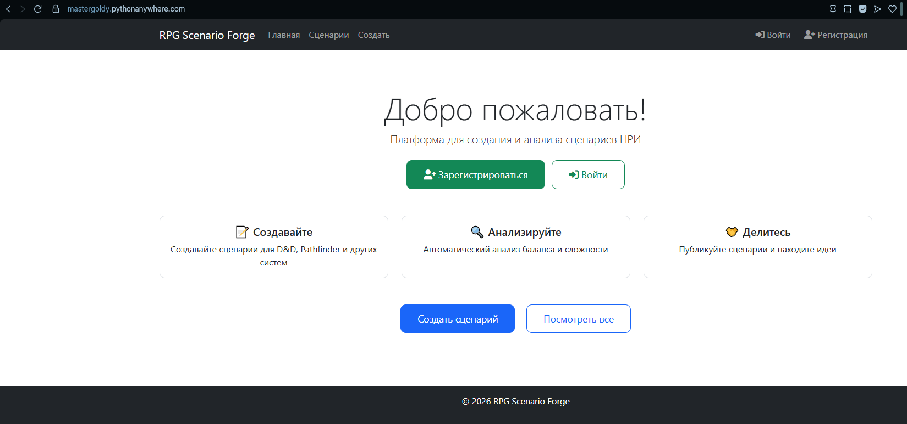
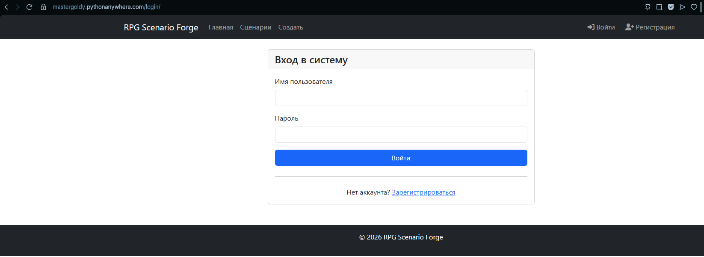
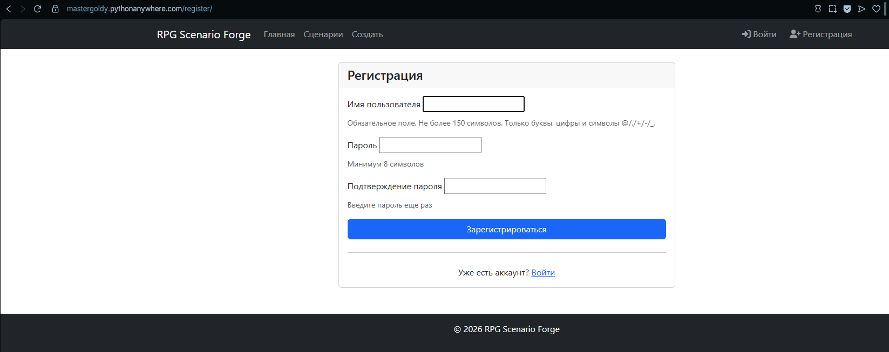
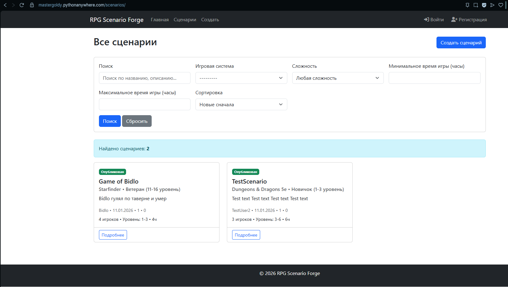
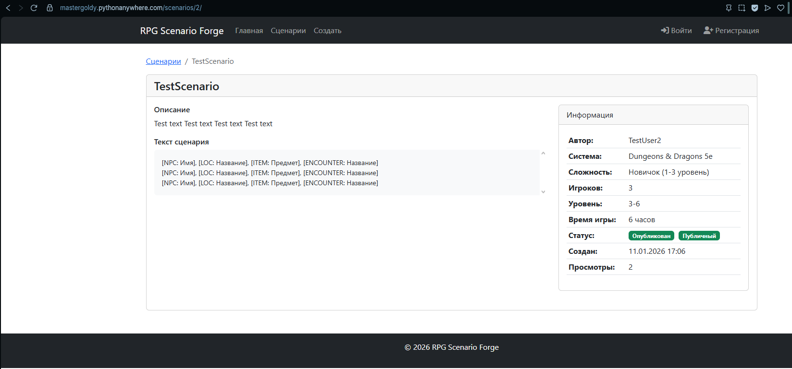
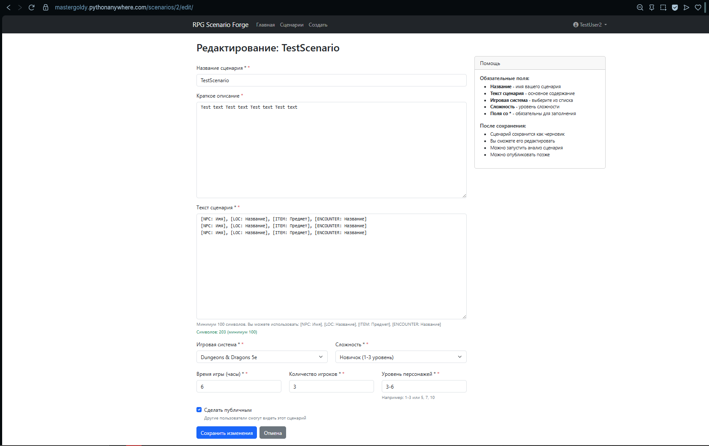
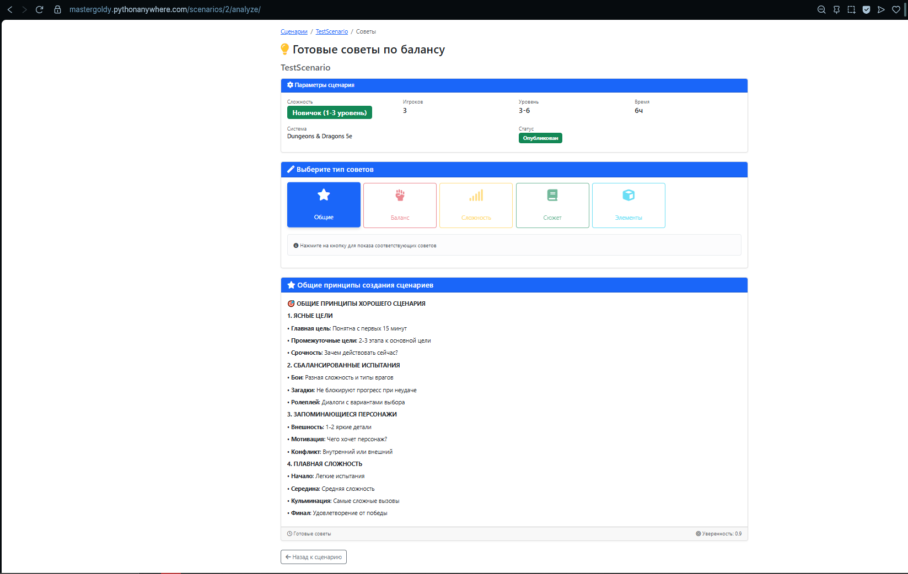

# RPG Scenario Forge

**Минималистичная система для создания и управления RPG сценариями**


**RPG Scenario Forge** — это минимально жизнеспособный продукт (MVP) для мастеров настольных ролевых игр. Приложение позволяет создавать, хранить и систематизировать игровые сценарии. Проект разработан за 5 дней с фокусом на основной функционал.

## Основные возможности

### Базовый функционал
- **Создание сценариев** с основными параметрами: название, описание, уровень сложности, время прохождения, количество игроков
- **Управление сценариями**: добавление, редактирование, удаление собственных сценариев
- **Просмотр сценариев** от всех пользователей системы
- **Фильтрация** сценариев по автору
- **Базовая аналитика** со статичными советами по улучшению сценариев

### Особенности реализации
- Простая и понятная архитектура без излишней сложности
- Быстрая разработка (5 дней от идеи до рабочего MVP)
- Минимальные зависимости для легкого развертывания
- Базовая безопасность: авторизация пользователей, защита от CSRF атак

## Что НЕ реализовано в MVP

Для соблюдения сроков разработки следующие функции не были реализованы:

- Система тегов (используются только категории)
- Сложная аналитика и динамические рекомендации (только статичные советы)
- Роли модераторов
- Возможность удаления чужих сценариев и профилей
- Система оценок, рейтингов и отзывов
- Расширенный поиск по содержимому
- API для внешних интеграций
- Экспорт/импорт данных

## Скриншоты интерфейса

### 1. Главная страница


### 2. Страница входа


### 3. Регистрация


### 4. Список всех сценариев


### 5. Детальный просмотр сценария


### 6. Форма создания/редактирования сценария


### 7. Страница анализа


## Быстрый старт

### Предварительные требования
- Python 3.8 или выше
- pip (менеджер пакетов Python)

### Установка и запуск

1. **Клонирование репозитория**
```bash
git clone https://github.com/MasterGoldy/RPG_scenario_forge.git
cd RPG_scenario_forge
```

2. **Создание виртуального окружения**
```bash
python -m venv venv
```

3. **Активация виртуального окружения**
Для Windows:
```bash
venv\Scripts\activate
```
Для Linux/Mac:
```bash
source venv/bin/activate
```

4. **Установка зависимостей**
```bash
pip install -r requirements.txt
```

5. **Настройка базы данных**
```bash
python manage.py migrate
python manage.py createsuperuser
```

6. **Запуск сервера разработки**
```bash
python manage.py runserver
```

7. **Открытие в браузере**
```bash
http://localhost:8000
```

# Структура проекта
**Основные директории и файлы**
```text
RPG_scenario_forge/
├── core/                          # Основное приложение
├── rpg_scenario_forge/           # Настройки проекта
├── static/                       # Статические файлы
├── templates/                    # HTML шаблоны
├── screenshots/                  # Скриншоты интерфейса
├── .gitignore                    # Игнорируемые файлы
├── .pythonanywhere.yml           # Конфигурация для деплоя
├── manage.py                     # Точка входа Django
├── README.md                     # Этот файл
├── SETUP.md                      # Подробная инструкция установки
├── requirements.txt              # Зависимости Python
└── TZ.md                         # Техническое задание
```

# Подробное описание структуры

**Приложение core/**
Содержит всю бизнес-логику проекта:

models.py — модели данных (Сценарий, Категория)

views.py — контроллеры для обработки запросов

forms.py — формы для создания и редактирования сценариев

urls.py — маршруты внутри приложения

admin.py — настройка админ-панели Django

migrations/ — файлы миграций базы данных

**Настройки проекта rpg_scenario_forge/**

Конфигурационные файлы Django:

settings.py — основные настройки проекта

urls.py — главный файл маршрутизации

wsgi.py и asgi.py — точки входа для развертывания

**Шаблоны templates/**

HTML-шаблоны организованы по приложениям:

core/ — основные страницы приложения

auth/ — страницы аутентификации

base.html — базовый шаблон для наследования

**Статические файлы static/**

Ресурсы для фронтенда:

css/ — таблицы стилей

js/ — JavaScript файлы

core/ — специфичные для приложения статические файлы

# Модели данных
**Сценарий (Scenario)**

Основная сущность приложения включает:

Название сценария

Подробное описание и полный текст

Уровень сложности (начальный, средний, продвинутый, эксперт)

Предполагаемое время прохождения в часах

Рекомендуемое количество игроков

Связь с автором (пользователем)

Категорию сценария

Статус (черновик, опубликован, архив)

Даты создания и обновления

**Категория (Category)**

Простая система категоризации сценариев:

Подземелья

Квестовые цепочки

Социальные взаимодействия

Сражения с боссами

**Пользователь (User)**

Стандартная модель пользователя Django с дополнительным профилем.

# Роли пользователей
**Гость (неавторизованный пользователь)**

Просмотр опубликованных сценариев

Возможность зарегистрироваться в системе

**Авторизованный пользователь**

Все возможности гостя

Создание собственных сценариев

Редактирование и удаление своих сценариев

Управление статусами сценариев (черновик/опубликовано)

Доступ к странице анализа

**Администратор**

Полный доступ через админ-панель Django

Управление всеми сценариями и пользователями

Настройка системы

# Маршруты (URLs)
**Основные маршруты**

/ — Главная страница

/login/ — Вход в систему

/register/ — Регистрация нового пользователя

/scenarios/ — Список всех сценариев

/scenarios/create/ — Создание нового сценария

/scenarios/<id>/ — Детали конкретного сценария

/scenarios/<id>/edit/ — Редактирование сценария

/scenarios/<id>/delete/ — Удаление сценария

/analysis/ — Страница анализа сценариев

**Административные маршруты**

/admin/ — Админ-панель (только для администраторов)

# Технологии
**Backend**
Django 4.0+ — основной веб-фреймворк

SQLite — база данных для разработки

Django ORM — работа с базой данных

Python-Decouple — управление переменными окружения

**Frontend**
HTML5 — разметка страниц

CSS3 — стилизация

Bootstrap 5 — адаптивный дизайн и компоненты

JavaScript — базовая интерактивность

# Инструменты разработки
Git — система контроля версий

GitHub — хостинг репозитория

SQLite Browser — просмотр базы данных

VS Code/PyCharm — среды разработки

# Конфигурация

Файл .env
Создайте в корне проекта файл .env со следующим содержимым:

```text
DEBUG=True
SECRET_KEY=ваш-секретный-ключ
ALLOWED_HOSTS=localhost,127.0.0.1
```

# Основные зависимости проекта:

```text
# Django
Django==4.2.11

# Forms
django-crispy-forms==2.0
crispy-bootstrap5==2024.2

# Environment variables
python-dotenv==1.0.0

# API requests
requests==2.31.0

# Data analysis
pandas==2.1.4
plotly==5.18.0
numpy==1.26.0
python-decouple==3.8
whitenoise==6.5.0
```

# Деплой

**На PythonAnywhere**

1. Зарегистрируйтесь на pythonanywhere.com

2. Создайте новый веб-приложение

3. Настройте виртуальное окружение

4. Клонируйте репозиторий

5. Настройте статические файлы и базу данных

6. Запустите приложение

**На собственном сервере**

1. Установите Python и необходимые зависимости

2. Настройте базу данных (PostgreSQL для продакшн)

3. Настройте веб-сервер (Nginx + Gunicorn)

4. Настройте домен и SSL сертификат

5. Запустите приложение в production-режиме

# Разработка

**Этапы разработки (5 дней)**

День 1 — Настройка проекта, модели, база данных

День 2 — Аутентификация, CRUD операции для сценариев

День 3 — Шаблоны, интерфейс, навигация

День 4 — Аналитика, фильтрация, права доступа

День 5 — Тестирование, исправление ошибок, подготовка к деплою

Команды для разработки
Запуск тестового сервера
```bash
python manage.py runserver
```
**Создание миграций**

```bash
python manage.py makemigrations
python manage.py migrate
```
**Создание суперпользователя**

```bash
python manage.py createsuperuser
```
**Проверка кода**

```bash
python manage.py check
```
**Сборка статических файлов**
```bash
python manage.py collectstatic
```
# Возможности для расширения
**Приоритет 1 (ближайшие улучшения)**

Система тегов для более гибкой категоризации

Простая система оценок (лайки)

Комментарии к сценариям

Полнотекстовый поиск по содержимому

**Приоритет 2 (среднесрочные улучшения)**

Экспорт сценариев в форматы PDF/Markdown

Более сложная аналитика с графиками и статистикой

REST API для мобильного приложения

Система избранного и закладок

**Приоритет 3 (долгосрочные улучшения)**

Совместное редактирование сценариев

Генератор NPC (неигровых персонажей)

Интеграция с картографическими сервисами

Плагины для популярных игровых систем